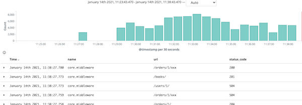
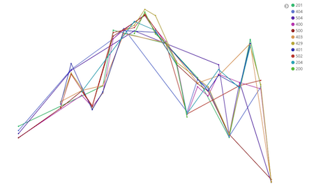
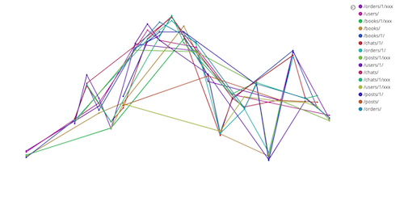

# django-elk

### stack
* Django
* Nginx
* Filebeat
* Logstash
* ElasticSearch
* Kibana

### Attention
```
After docker-compose up should wait for logstash service up or log will not send...(by docker-compose logs logstash)
```

### Reference
logstash pattern [link](https://github.com/logstash-plugins/logstash-patterns-core/blob/master/patterns/grok-patterns)


### Visualize

# Line chart(status_code, url)
```
1. Y-Axis : Aggregation select "Count"
2. X-Axis : Aggregation select "Date Histogram", Field select @timestamp
3. Add sub-buckets select "Split Series", Sub Aggregation select "Terms" and Field select "status_code.keyword"
```

# Screenshot


